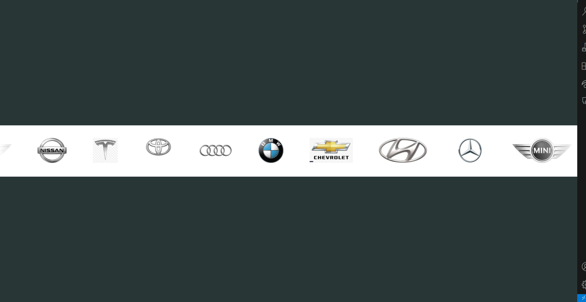

## Infinite Logo Carousel

This project demonstrates how to create an infinite logo animation using HTML, CSS, and JavaScript. The carousel showcases multiple logos in a continuous, looping format, providing an engaging way to display brand partners or clients.

### Features

- Infinite Animation: Logos scroll continuously in a loop for smooth viewing.
- Simple Implementation: Easy to set up with minimal code.

#### Screenshot



### Getting Started

1. Clone the repository :

```bash
git clone <repository-url>
```

2. Open `index.html` in your web browser to view the carousel in action.

### Usage

Customize the logo images in the HTML file to feature your desired logos and adjust the CSS for styling preferences.
